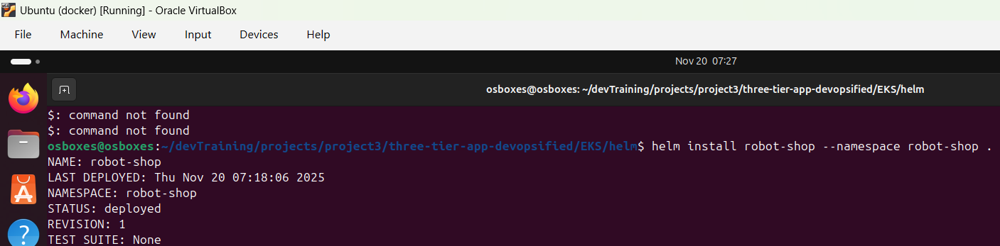
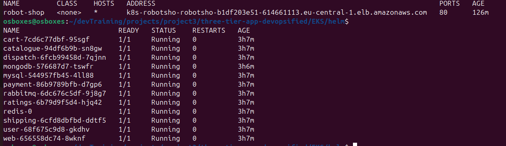
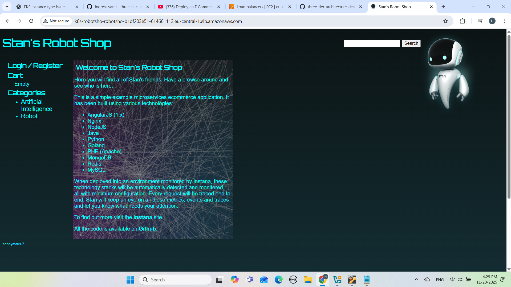
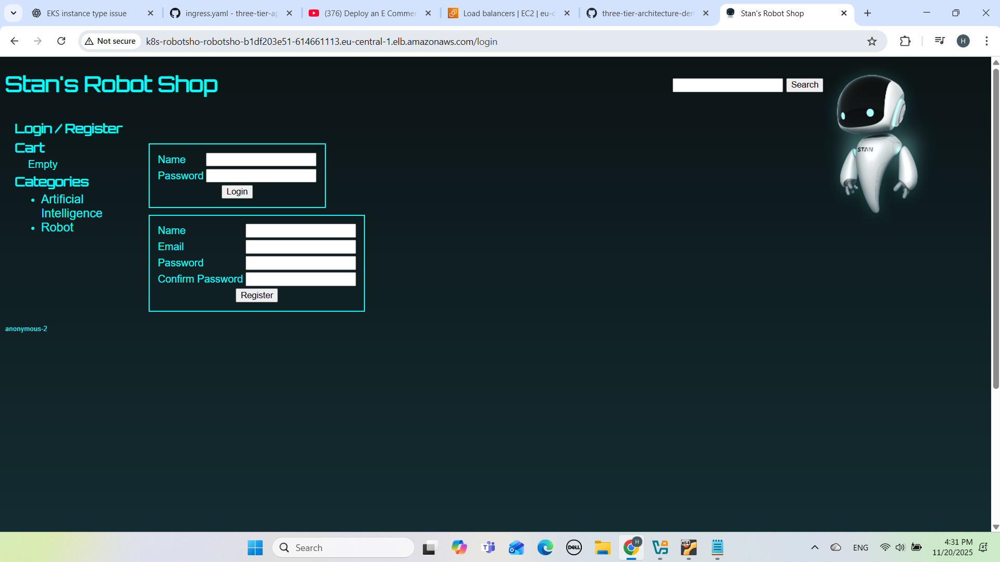
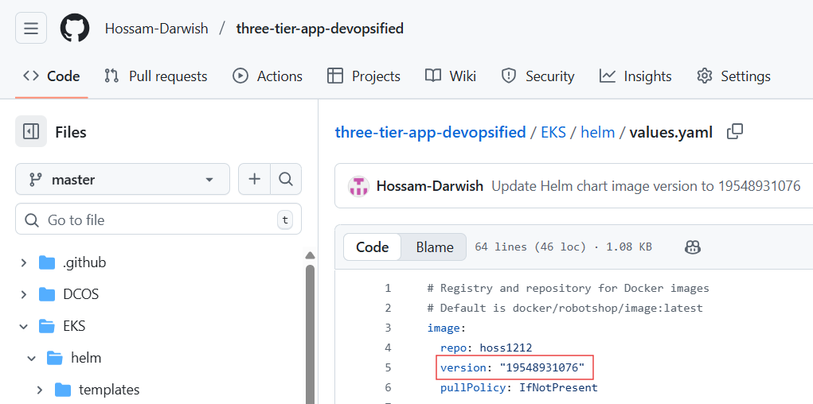
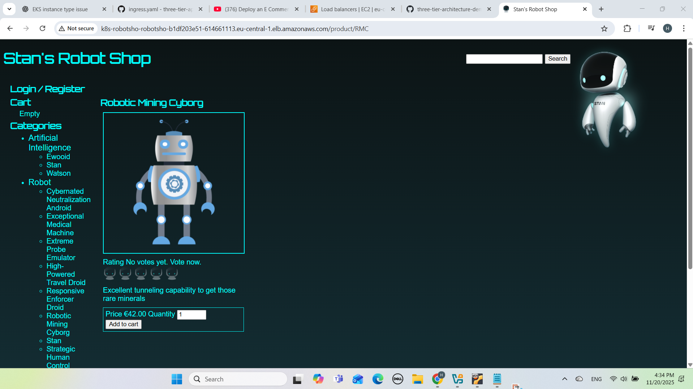
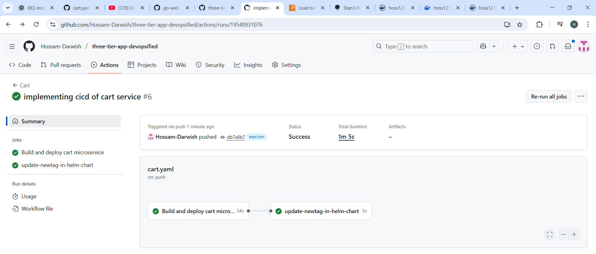
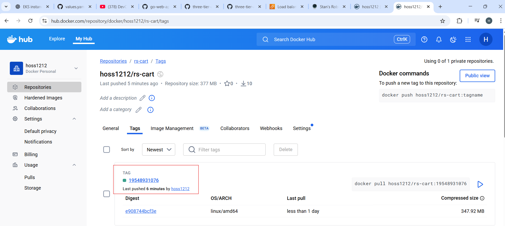
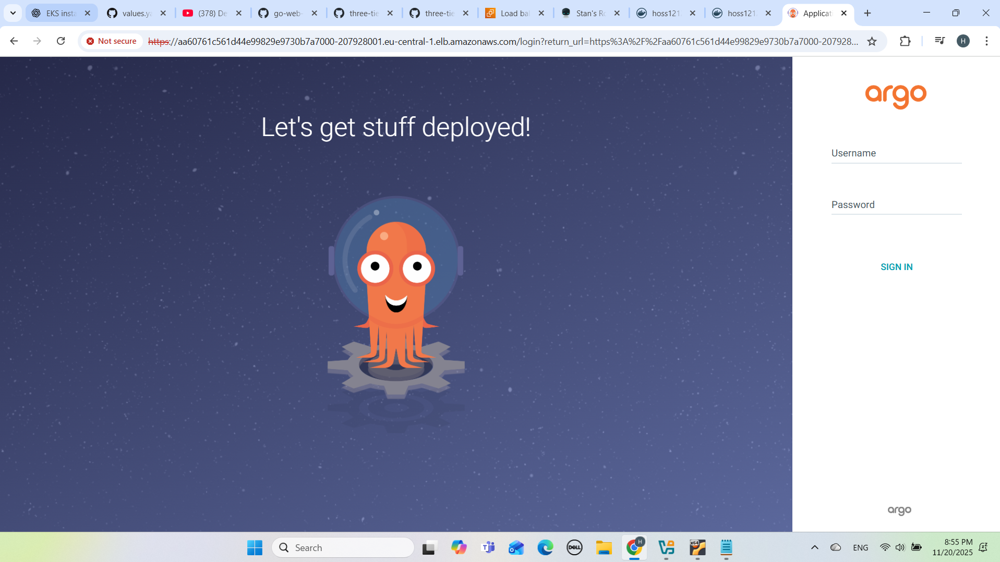

# Three-Tier App DevOpsified

## End-to-End DevOps Pipeline on AWS EKS using Terraform, Docker, GitHub Actions & ArgoCD

### Purpose: 

To demonstrate an end-to-end DevOps pipeline using Infrastructure as Code (Terraform), Continuous Integration (GitHub Actions), Containerization (Docker), Helm packaging, and Continuous Delivery via GitOps (ArgoCD) on AWS EKS.

_______________________________________________________________________________________________

### Architecture Overview

This project deploys the Robot Shop microservices application on an EKS cluster using a fully automated DevOps pipeline:

Developer Push → GitHub Actions CI → DockerHub → ArgoCD → AWS EKS

______________________________________________________________________________________________

### High-Level Architecture

                         ┌───────────────────────┐
                         │     GitHub Repo       │
                         │  (Application + IaC)  │
                         └───────────┬───────────┘
                                     │ Commit / PR
                                     ▼
                         ┌────────────────────────┐
                         │   GitHub Actions CI    │
                         │ - Build & Test         │
                         │ - Dockerize Service    │
                         │ - Push Image Tag       │
                         │   (github.run_id)      │
                         └───────────┬────────────┘
                                     │ Updated Helm values.yaml
                                     ▼
                         ┌────────────────────────┐
                         │       ArgoCD           │
                         │ GitOps Continuous CD   │
                         └───────────┬────────────┘
                                     │ Sync to Cluster
                                     ▼
                    ┌──────────────────────────────────┐
                    │              AWS EKS             │
                    │ - 3 Worker Nodes (Managed)       │
                    │ - ALB Ingress Controller         │
                    │ - EBS CSI Driver                 │
                    │ - Helm-Deployed Microservices    │
                    └──────────────────────────────────┘
___________________________________________________________________________________________

## Features Implemented

### Infrastructure (IaC)

- AWS EKS cluster (Terraform)

- Managed Node Group

- OIDC Provider + IRSA

- AWS ALB Ingress Controller (via Helm)

- AWS EBS CSI Driver (via Helm)

- IAM roles, policies, VPC, subnets, security groups

- Automatic Ingress creation with ALB

### Application (Workload)

#### Robot Shop microservices deployed via Helm chart:

- Cart service modified for CI/CD demonstration

- Multi-language microservices (Node, Python, Java, Go, etc.)

### CI – GitHub Actions

- Build

- Test

- Dockerize Cart microservice

- Push to DockerHub

- Auto-update Helm chart image tag (github.run_id)

### CD – ArgoCD

- Automatic sync (GitOps)

- Real-time updates when Helm values.yaml changes

- Deployed from GitHub repo into EKS

### Other Tools

- DockerHub for public container registry

- AWS Load Balancer Controller for external access

- Helm for packaging and deployment

_______________________________________________________________

## CI Pipeline (GitHub Actions)

### The workflow performs:

- Checkout code

- Build Docker image

- Tag with:

### ${{ github.run_id }}

- Push to DockerHub

- Update values.yaml via sed:

### sed -i 's/tag:.*/tag: "'${{ github.run_id }}'"/'

- Commit updated Helm tag

- ArgoCD auto-sync deploys it immediately

_________________________________________________________________________________

## CD Pipeline (ArgoCD)

### ArgoCD is configured with:

- Automatic Sync

- Self-heal enabled

- Monitored Helm chart path in GitHub repo

- Deploys directly to EKS in eu-central-1

ArgoCD automatically detects changes pushed by GitHub Actions and updates the Cart microservice.

_____________________________________________________________________________________________________________

## Application Access

The AWS ALB Ingress Controller exposes the frontend via a public ALB.

After deployment:

- Retrieve ALB DNS name

- App accessible directly in browser

_____________________________________________________________________________________________________

## Screenshot Gallery

.png)

____________________________________________________________________________________________________________________

## Service Used for CI/CD Demo

This project uses Cart microservice as the full CI/CD example:

- Build

- Test

- Dockerize

- Push

- Auto-deploy via ArgoCD

___________________________________________________________________________

## AWS Deployment

- Region: eu-central-1

- EKS cluster with managed node group

- ALB ingress & EBS CSI created via Helm

___________________________________________________________________________

## Conclusion

#### This project demonstrates a full production-grade DevOps pipeline, including:

- Infrastructure provisioning

- Containerized workloads

- CI with GitHub Actions

- GitOps CD with ArgoCD

- Cloud deployment on EKS

- Helm-managed microservices

- Real microservices app as workload

- It showcases the essential skills required for Cloud DevOps roles.

